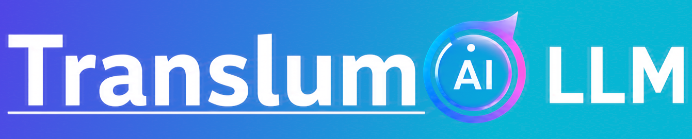
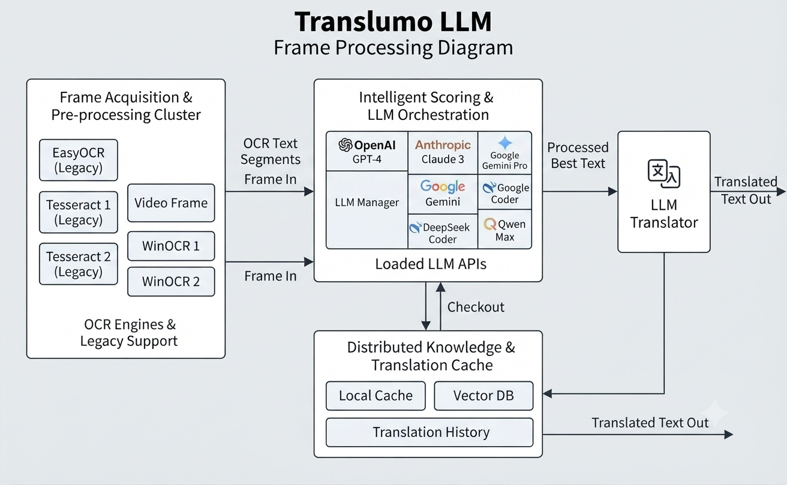
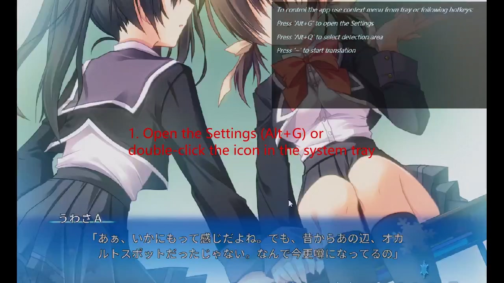
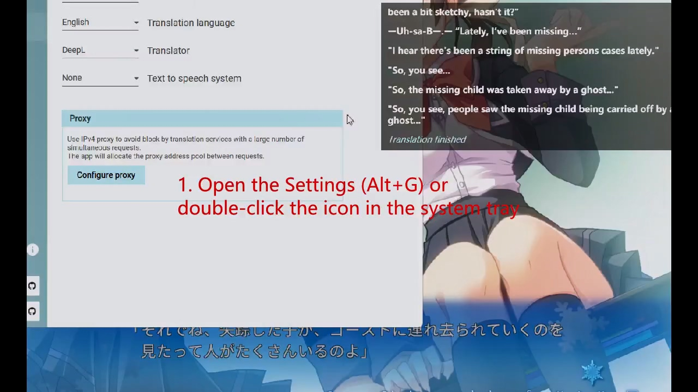

[](https://opensource.org/licenses/Apache-2.0)
[](https://github.com/Chaobs/Translumo-LLM/releases)

<p align="center">
  
</p>

<h2 align="center" style="border: 0">Translumo LLM — Advanced Real-Time Screen Translator (LLM Edition)</h2>

<p align="center"><strong>English</strong> | <a href="docs/README-ZH.md"><strong>简体中文</strong></a></p>

> **LLM Edition** — a fork of [Translumo](https://github.com/ramjke/Translumo) by
> [Chaobs](https://github.com/Chaobs). It adds **LLM AI translation** (DeepSeek, Qwen, Kimi, GLM, MiniMax,
> ChatGPT, Claude, Gemini, Grok and custom OpenAI-compatible endpoints) on top of the original OCR engines,
> plus Simplified/Traditional Chinese and Japanese localization. See [NOTICE](NOTICE) for the full changelog.
> Project page: [github.com/Chaobs/Translumo-LLM](https://github.com/Chaobs/Translumo-LLM) ·
> Report issues: [Chaobs/Translumo-LLM/issues](https://github.com/Chaobs/Translumo-LLM/issues)

## Original Project

Translumo-LLM is built upon **[Translumo](https://github.com/ramjke/Translumo)** — the original
real-time screen translator by [ramjke](https://github.com/ramjke). Visit the upstream project for its
background, history, and the original feature set that this LLM edition extends.

## Download Translumo-LLM

**Direct download link to the latest version (v1.1.4):**

[Translumo-LLM-v1.1.4.zip](https://github.com/Chaobs/Translumo-LLM/releases/download/v1.1.4/Translumo-LLM-v1.1.4.zip)

After downloading, unzip the archive and run `Translumo-LLM.exe`. All required dependencies (Python
runtime, OCR models, and WebView2) are bundled — no separate installation is needed.

Full release history: [Chaobs/Translumo-LLM/releases](https://github.com/Chaobs/Translumo-LLM/releases)

## Main Features

- **LLM AI translation**
  Use large language models for higher-quality, context-aware, and more natural translations. Supported
  providers: DeepSeek, Qwen, Kimi, GLM (Zhipu), MiniMax, ChatGPT, Claude, Gemini, Grok, and any
  OpenAI-compatible custom endpoint. Configure them from **Settings → Manage API**.

- **High text recognition precision**
  Translumo combines multiple OCR engines and uses a machine-learning model to score each result, then
  selects the best one.

  <p align="center">
    
  </p>

- **Game oriented**
  Designed for real-time translation in PC games, but works anywhere on screen with any application.

- **Low latency**
  Several optimizations reduce system impact and minimize latency between text appearance and translation.

- **Integrated modern OCR engines**: Windows OCR (recommended), Tesseract 5.2 (legacy), EasyOCR (legacy).

- **Available classic translators**: DeepL (recommended), Google Translate, Yandex Translate, Naver Papago.

- **Supported recognition languages**: English, Russian, Japanese, Chinese (Simplified), Korean.

- **Supported translation languages**: English, Russian, Japanese, Chinese (Simplified), Korean, French,
  Spanish, German, Portuguese, Italian, Vietnamese, Thai, Turkish, Arabic, Greek, Brazilian Portuguese,
  Polish, Belarusian, Persian, Indonesian, Bulgarian, Czech, Danish, Estonian, Finnish, Hungarian,
  Lithuanian, Latvian, Dutch, Romanian, Slovak, Slovenian, Swedish, Ukrainian.

## System Requirements

### Minimal requirements to use Tesseract and Windows OCR
- Windows 10 version 2004 (build 19041) or later, or Windows 11
- DirectX 11 compatible GPU
- 2 GB RAM

### Minimal requirements to use EasyOCR
- NVIDIA GPU with CUDA SDK 11.8 support (GTX 750, 8xxM, 9xx series or newer)
- 8 GB RAM
- At least 5 GB of free storage space

## How to Use

**English demo:**

[](https://github.com/user-attachments/assets/7149c277-d5ec-489c-b37e-8ad769a09a43)

1. Open the Settings (**Alt+G**) or double-click the icon in the system tray
2. Select languages: source language for OCR and translation language
3. Select text recognition engines (see Usage Tips for recommended modes)
4. Define the capture area: press **Alt+Q** and select an area on the screen
5. Run translation (press **~**)

1. 打开“设置”（Alt+G）或双击系统托盘中的图标
2. 选择语言：识别的源语言和翻译目标语言
3. 选择文字识别器（推荐模式请参见“使用提示”）
4. 定义捕获区域：按 Alt+Q 并在屏幕上选择一个区域
5. 开始翻译（按 ~）

### Recommended OCR Engines

- It is recommended to use **WindowsOCR** only.

Tesseract is old, slow, and produces many errors.  
EasyOCR is even slower, requires significant resources (including a specific GPU), and often leads to bugs.

It is generally better to keep only WindowsOCR, but the other engines are still included for historical reasons.

### Select Minimum Capture Area
Reducing the capture area decreases the chance of picking up random letters from the background. Larger frames take longer to process.

### Use Proxy List to Avoid Blocking by Translation Services
Some translators may block clients sending many requests. Configure personal or shared IPv4 proxies (1–2 is usually enough) under **Languages → Proxy tab**. The app alternates proxies to reduce requests from a single IP.

### Use Borderless or Windowed Modes in Games (Not Fullscreen)
These modes are required for correct translation overlay display. If your game does not support them, use tools like [Borderless Gaming](https://github.com/Codeusa/Borderless-Gaming).

## AI Config Tutorial

LLM translation requires an API key from your chosen provider. The short flow:

**English demo:**

[](https://github.com/user-attachments/assets/3dadc829-9001-491b-9e42-eb2ffd87688f)

1. Open the Settings (**Alt+G**) or double-click the icon in the system tray
2. Click **Manage API**
3. Select your AI provider and models, then enter your API key
4. Define the capture area: press **Alt+Q** and select an area on the screen
5. Run translation (press **~**)

1. 打开“设置”（Alt+G）或双击系统托盘中的图标
2. 点击“管理 API”
3. 选择您的 AI 服务提供商和模型，然后输入您的 API 密钥
4. 定义捕获区域：按 Alt+Q 并选择屏幕上的一个区域
5. 开始翻译（按 ~）

> API keys are stored locally and protected with OS-level encryption (DPAPI) on first launch. They are
> never sent anywhere except to the provider you configure.

## FAQ

**Q: How do I configure LLM translation?**
A: Open **Settings → Manage API**, choose a provider (DeepSeek, Qwen, Kimi, GLM, MiniMax, ChatGPT, Claude, Gemini, Grok, or a custom OpenAI-compatible endpoint), select a model, and enter your API key. See the AI Config Tutorial above.

**Q: LLM translation returns errors or no result**
A: Verify your API key is correct and has remaining quota, the selected model is available for your account, and your network can reach the provider. If a translator blocks frequent requests, configure a proxy under **Languages → Proxy tab**.

**Q: I get "Failed to capture screen" or nothing happens after translation starts**
A: Ensure the target window is active. Restart Translumo-LLM or reopen the target window if needed.

**Q: Borderless/windowed mode is set, but the translation window is under the game**
A: With the game running and focused, press the hotkey (**Alt+T** by default) to hide and show the translation window.

**Q: Hotkeys don't work**
A: Other applications may be intercepting hotkeys.

**Q: Text detection failed (TesseractOCREngine)**
A: Ensure the application path contains only Latin letters.

## Build

*Visual Studio 2022 and the .NET 8 SDK are required.*

1. Clone the repository (the **master** branch always corresponds to the latest release):

    ```bash
    git clone https://github.com/Chaobs/Translumo-LLM.git
    ```

> Note: During the build, **binaries_extract.bat** automatically downloads and extracts models and Python
> binaries (~400 MB) to the target output directory. The release build is published as a single-file
> executable (`dotnet publish` with `PublishSingleFile=true`); on launch the .NET host extracts the bundle
> to a local `temp\` folder next to the executable.

## Credits

- [Translumo](https://github.com/ramjke/Translumo) — the original real-time screen translator by ramjke, which this LLM edition is based on. Thank you for the outstanding work.
- [Material Design In XAML Toolkit](https://github.com/MaterialDesignInXAML/MaterialDesignInXamlToolkit)
- [Tesseract .NET wrapper](https://github.com/charlesw/tesseract)
- [OpenCvSharp](https://github.com/shimat/opencvsharp)
- [Python.NET](https://github.com/pythonnet/pythonnet)
- [EasyOCR](https://github.com/JaidedAI/EasyOCR)
- [Silero TTS](https://github.com/snakers4/silero-models)
