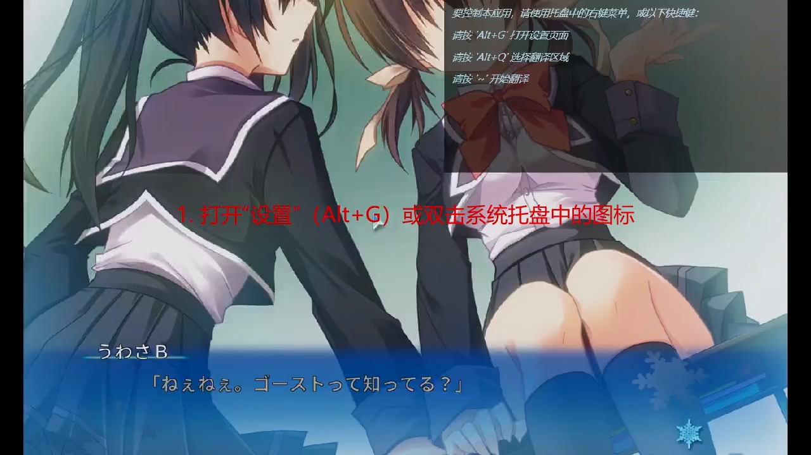
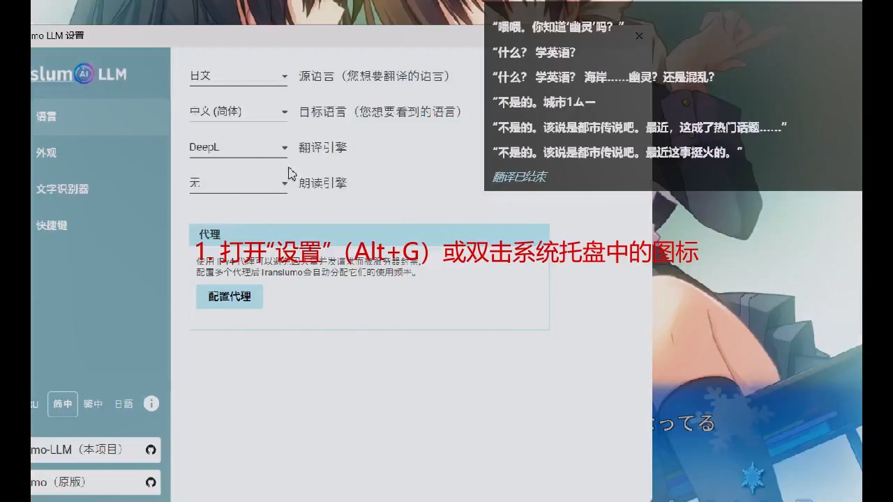

[](https://opensource.org/licenses/Apache-2.0)
[](https://github.com/Chaobs/Translumo-LLM/releases)

<p align="center">
  
</p>

<h2 align="center" style="border: 0">Translumo LLM — 进阶实时屏幕翻译器（LLM 增强版）</h2>

<p align="center"><a href="../README.md"><strong>English</strong></a> | <strong>简体中文</strong></p>

> **LLM 增强版** —— 由 [Chaobs](https://github.com/Chaobs) 基于
> [Translumo](https://github.com/ramjke/Translumo) 修改的分支。在原版 OCR 引擎之上新增了
> **LLM AI 翻译**（DeepSeek、通义千问 Qwen、Kimi、智谱 GLM、MiniMax、ChatGPT、Claude、Gemini、Grok、
> 通过 Ollama 运行的本地模型，以及自定义 OpenAI 兼容接口），并补充了简体/繁体中文与日语本地化。
> 完整变更见 [NOTICE](../NOTICE)。
> 项目主页：[github.com/Chaobs/Translumo-LLM](https://github.com/Chaobs/Translumo-LLM) ·
> 问题反馈：[Chaobs/Translumo-LLM/issues](https://github.com/Chaobs/Translumo-LLM/issues)

## 原始项目

Translumo-LLM 建立在 **[Translumo](https://github.com/ramjke/Translumo)** 之上 —— 这是由
[ramjke](https://github.com/ramjke) 开发的原始实时屏幕翻译器。如需了解其背景、历史与原版功能集，
请访问上游项目。

> **说明：** 由于 Translumo-LLM 已新增大量与原项目不兼容的特性（LLM 翻译、Ollama 本地模型、新的
> 界面本地化、主题切换、即时图片翻译等），本项目已**从上游 fork 中脱离（detach fork）**，今后作为
> **独立项目**运营。后续开发在此继续进行，不再与 ramjke/Translumo 同步。

## 下载 Translumo-LLM

**最新版本（v1.2.2）直链：**

[Translumo-LLM-v1.2.2.zip](https://github.com/Chaobs/Translumo-LLM/releases/download/v1.2.2/Translumo-LLM-v1.2.2.zip)

下载后解压压缩包并运行 `Translumo-LLM.exe` 即可。所有必需的依赖（Python 运行时、OCR 模型、WebView2）
均已打包在内，无需单独安装。

完整发布历史：[Chaobs/Translumo-LLM/releases](https://github.com/Chaobs/Translumo-LLM/releases)

## 主要功能

- **LLM AI 翻译**
  借助大语言模型获得更高质量、更具上下文感知、更自然的翻译。支持的供应商包括：DeepSeek、通义千问
  Qwen、Kimi、智谱 GLM、MiniMax、ChatGPT、Claude、Gemini、Grok、**Ollama（本地运行开源模型，无需
  API 密钥）**，以及任意 OpenAI 兼容的自定义接口。可在 **设置 → 管理 API** 中配置。

- **高精度文字识别**
  Translumo 可同时结合多个 OCR 引擎，并使用机器学习模型对每个识别结果打分，自动选取最佳结果。

  <p align="center">
    
  </p>

- **面向游戏**
  专为 PC 游戏中的实时翻译而设计，但也适用于屏幕上任何应用程序的任意位置。

- **低延迟**
  多项优化降低了系统占用，并尽可能缩短从文字出现到翻译完成之间的延迟。

- **内置现代化文字识别器**：Windows OCR（推荐）、Tesseract 5.2（旧版）、EasyOCR（旧版）。

- **内置经典翻译服务**：DeepL（推荐）、Google 翻译、Yandex 翻译、Naver Papago。

- **支持的识别语言**：英语、俄语、日语、简体中文、韩语。

- **支持的翻译语言**：英语、俄语、日语、简体中文、韩语、法语、西班牙语、德语、葡萄牙语、意大利语、
  越南语、泰语、土耳其语、阿拉伯语、希腊语、巴西葡萄牙语、波兰语、白俄罗斯语、波斯语、印尼语、
  保加利亚语、捷克语、丹麦语、爱沙尼亚语、芬兰语、匈牙利语、立陶宛语、拉脱维亚语、荷兰语、罗马尼亚语、
  斯洛伐克语、斯洛文尼亚语、瑞典语、乌克兰语。

## 系统要求

### 使用 Tesseract 与 Windows OCR 的最低要求
- Windows 10 2004 版本（内部版本 19041）或更高，或 Windows 11
- 支持 DirectX 11 的 GPU
- 2 GB 内存

### 使用 EasyOCR 的最低要求
- 支持 CUDA SDK 11.8 的 NVIDIA GPU（GTX 750、8xxM、9xx 系列或更新）
- 8 GB 内存
- 至少 5 GB 可用存储空间

## 使用说明

**中文演示：**

[](https://github.com/user-attachments/assets/50adb44e-c9b0-4884-b47f-dbb5fbeb3078)

1. 打开“设置”（Alt+G）或双击系统托盘中的图标
2. 选择语言：识别的源语言和翻译目标语言
3. 选择文字识别器（推荐模式请参见“使用提示”）
4. 定义捕获区域：按 Alt+Q 并在屏幕上选择一个区域
5. 开始翻译（按 ~）

### 推荐的文字识别器

- 建议仅使用 **WindowsOCR**。

Tesseract 老旧、速度慢且错误较多。  
EasyOCR 更慢，需要大量资源（包括特定 GPU），且经常引发问题。

通常建议只保留 WindowsOCR，但为了兼容历史版本，其他引擎仍被保留。

### 尽量缩小捕获区域
缩小捕获区域可减少从背景中误识别到零散字符的概率。较大的区域处理耗时更长。

### 使用代理列表避免被翻译服务封禁
部分翻译服务可能会封禁发送大量请求的客户端。可在 **语言 → 代理** 选项卡中配置个人或共享的 IPv4
代理（通常 1–2 个即可）。程序会轮换使用代理，以降低单一 IP 的请求频率。

### 在游戏中使用无边框或窗口模式（不要全屏）
这些模式是确保翻译浮层正确显示的前提。若游戏不支持，可使用
[Borderless Gaming](https://github.com/Codeusa/Borderless-Gaming) 等工具。

## AI 配置教程

LLM 翻译需要你所选供应商的 API 密钥。简要流程如下：

**中文演示：**

[](https://github.com/user-attachments/assets/0788cc9b-0218-47eb-8f67-7e5499be86e9)

1. 打开“设置”（Alt+G）或双击系统托盘中的图标
2. 点击“管理 API”
3. 选择您的 AI 服务提供商和模型，然后输入您的 API 密钥
4. 定义捕获区域：按 Alt+Q 并选择屏幕上的一个区域
5. 开始翻译（按 ~）

> API 密钥仅保存在本地，并在首次启动时通过操作系统级加密（DPAPI）保护。除你所配置的供应商外，
> 密钥不会被发送到任何地方。

## 常见问题

**Q：如何配置 LLM 翻译？**
A：打开 **设置 → 管理 API**，选择供应商（DeepSeek、通义千问、Kimi、智谱 GLM、MiniMax、ChatGPT、Claude、Gemini、Grok、Ollama，或自定义 OpenAI 兼容接口），选择模型并输入 API 密钥。对于 **Ollama** 无需 API 密钥，只需将其指向你本地的 Ollama 服务（默认 `http://localhost:11434`）。参见上方的 AI 配置教程。

**Q：什么是“Google Lens 风格”图片即时翻译功能？**
A：按 **Alt+D** 在屏幕上选择任意区域。Translumo-LLM 会一次性捕获该区域，通过 OCR 识别文字（源语言自动检测），并以你设置的目标语言显示翻译浮层。它非常适合处理不会持续变化的内容——游戏菜单、物品描述、对话框、路牌等。与连续翻译模式（Alt+Q + ~）不同，该模式按需翻译单个捕获帧。翻译优先使用你所配置的 LLM 供应商，若 LLM 失败则回退到 Google 翻译。如需更改目标语言，请在 **设置 → 语言** 中设置。

**Q：LLM 翻译报错或无结果**
A：请确认 API 密钥正确且有剩余额度、所选模型对你的账户可用，且网络能够访问对应供应商。若翻译服务因频繁请求而封禁，可在 **语言 → 代理** 选项卡中配置代理。

**Q：提示“Failed to capture screen”（无法捕获屏幕），或开始翻译后无反应**
A：请确认目标窗口处于激活状态。必要时重启 Translumo-LLM 或重新打开目标窗口。

**Q：已设置为无边框/窗口模式，但翻译窗口被游戏遮挡**
A：在游戏运行且处于焦点时，按热键（默认 **Alt+T**）可隐藏/显示翻译窗口。

**Q：热键无效**
A：可能有其他应用程序截获了热键。

**Q：文字识别失败（TesseractOCREngine）**
A：请确保应用程序所在路径仅包含拉丁字母。

## 构建

**环境要求**
- Windows 10（内部版本 19041）或更高 / Windows 11
- [.NET 8 SDK](https://dotnet.microsoft.com/download/dotnet/8.0)
- 推荐安装带有 **“.NET 桌面开发”** 工作负载的 Visual Studio 2022，或任何可运行 `dotnet` 命令的编辑器

**步骤**

1. 克隆仓库（**master** 分支始终对应最新发布版本）：
   ```bash
   git clone https://github.com/Chaobs/Translumo-LLM.git
   cd Translumo-LLM
   ```

2. 还原依赖并以 Release 模式构建解决方案：
   ```bash
   dotnet build Translumo-LLM.sln -c Release
   ```
   > 首次构建会运行 **binaries_extract.bat**，自动下载并解压 OCR 模型与内嵌 Python 运行时（约 400 MB）
   > 到输出目录。该过程仅执行一次，且需要联网。

3. 直接从构建输出运行（用于开发 / 测试）：
   ```bash
   dotnet run --project src/Translumo -c Release
   ```

4. 生成可分发的单文件构建：
   ```bash
   dotnet publish src/Translumo/Translumo.csproj -c Release -r win-x64 -p:SolutionDir="$(pwd)/"
   ```
   发布文件位于 `src/Translumo/bin/Release/net8.0-windows/win-x64/publish/`。首次启动时，.NET 宿主会将
   单文件程序包解压到可执行文件同级的本地 `temp\` 目录，随后正常运行。

## 更新日志（Changelog）

本节汇总自 Translumo 原项目以来，Translumo-LLM 新增的关键特性与修复的主要 Bug。

**新增特性**
- **LLM AI 翻译** —— 通过大语言模型获得更具上下文感知、更高质量的翻译，支持的供应商包括：DeepSeek、通义千问 Qwen、Kimi、智谱 GLM、MiniMax、ChatGPT、Claude、Gemini、Grok，以及任意自定义 OpenAI 兼容接口。
- **Ollama 本地模型支持** —— 通过 Ollama 在你自己的机器上完全本地运行开源 AI 模型，翻译无需 API 密钥，也无需联网。
- **Google Lens 风格图片即时翻译** —— 按 **Alt+D** 按需捕获并翻译屏幕上任意静态区域（详见 FAQ）。
- **界面本地化** —— 界面现已提供简体中文、繁体中文、日语、俄语与英语。
- **可切换的浅色/深色主题** —— 选择适合自己的外观。
- **TTS 语音切换** —— 在更多系统语音（含 OneCore 语音）中选择语音合成所用的声音。
- **安全的 API 密钥存储** —— 密钥在首次启动时通过操作系统级 DPAPI 加密。
- **LLM 翻译自动检测源语言** —— 无需手动设置 OCR 源语言。

**修复的主要 Bug**
- 修复了程序安装在包含非 ASCII 字符的路径（如中文/日文/俄文路径）下崩溃的问题——现在可在任意目录（包括非英文路径）下运行。
- 降低了因反复解压单文件 / 临时缓存导致的 **C 盘空间过度占用**。
- 修复了图片翻译中目标语言不跟随 **设置** 选择的问题。
- 修复了图片翻译浮层弹出过慢的问题（现可立即弹出，结果在后台填充）。
- 多项稳定性与兼容性改进。

## 待办清单（Todo-List）

未来的开发计划（尚未实现）：
1. **优化翻译稳定性与速度** —— 使 LLM 与经典翻译在负载下更可靠、更快速。
2. **修复潜在 Bug** —— 处理用户反馈与测试中发现的问题。
3. **提升运行效率、降低资源占用** —— 减少 CPU/GPU/内存开销，提升效率。
4. **开发更现代化的 UI** —— 以更简洁、直观的设计刷新界面。

## 致谢

- [Translumo](https://github.com/ramjke/Translumo) —— 由 ramjke 开发的原始实时屏幕翻译器，本 LLM 增强版即基于此项目。感谢其杰出的工作。
- [Material Design In XAML Toolkit](https://github.com/MaterialDesignInXAML/MaterialDesignInXamlToolkit)
- [Tesseract .NET wrapper](https://github.com/charlesw/tesseract)
- [OpenCvSharp](https://github.com/shimat/opencvsharp)
- [Python.NET](https://github.com/pythonnet/pythonnet)
- [EasyOCR](https://github.com/JaidedAI/EasyOCR)
- [Silero TTS](https://github.com/snakers4/silero-models)
